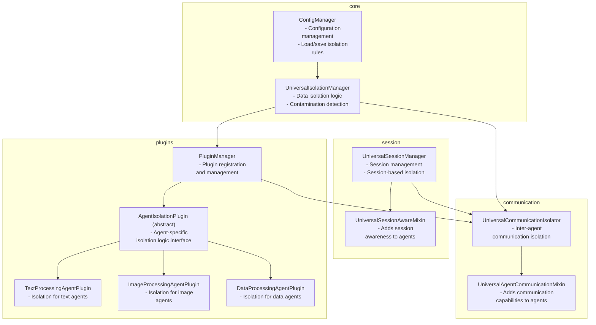

# Universal Agent Isolation Framework

A versatile data isolation system that can be used across various languages, domains, and agent types. This framework provides tools to prevent data contamination and ensure secure communication in multi-agent environments.

## 📋 Table of Contents

- [Key Features](#key-features)
- [System Architecture](#system-architecture)
- [Core Components](#core-components)
- [How It Works](#how-it-works)
- [Installation and Setup](#installation-and-setup)
- [Usage Examples](#usage-examples)
- [Extension Methods](#extension-methods)
- [License](#license)

## Key Features

- **Versatility**: Support for various languages, domains, and agent types
- **Modular Design**: Flexible architecture composed of clearly separated modules
- **Plugin System**: Customized isolation logic for different agent types
- **Session Management**: Session-based isolation support in multi-agent environments
- **Secure Communication**: Enhanced security for data transfer between agents
- **Extensibility**: Support for custom validators and isolation rules

## System Architecture

### System Components and Relationships



### Data Flow and Processes

```mermaid
flowchart TB
    subgraph "Data Isolation Process"
        Input["Input Data"] --> IsolationManager["UniversalIsolationManager"]
        IsolationManager -->|"Contamination Detection"| Detectors["ContaminationDetector (abstract)"]
        Detectors --> TextDetector["TextContaminationDetector"]
        Detectors --> RegexDetector["RegexContaminationDetector"]
        
        IsolationManager -->|"Contaminated Data"| FilterData["Filtered Data"]
        IsolationManager -->|"Clean Data"| CleanData["Purified Data"]
    end
    
    subgraph "Inter-agent Communication"
        Agent1["Source Agent"] --> CommIsolator["UniversalCommunicationIsolator"]
        CommIsolator -->|"Data Transfer"| DataTransfer["DataTransferRequest"]
        DataTransfer --> ValidationRules["Transfer Rule Validation"]
        ValidationRules -->|"Validation Failed"| BlockedResponse["Blocked Response"]
        ValidationRules -->|"Validation Successful"| CleaningProcess["Data Purification Process"]
        CleaningProcess --> Agent2["Target Agent"]
    end
    
    subgraph "Session Management"
        Session["Session Creation"] --> SessionConfig["SessionConfig Setup"]
        SessionConfig -->|"isolation_level: strict"| StrictIsolation["Strict Isolation"]
        SessionConfig -->|"isolation_level: moderate"| ModerateIsolation["Moderate Isolation"]
        SessionConfig -->|"isolation_level: loose"| LooseIsolation["Loose Isolation"]
        SessionConfig --> SessionValidation["Inter-session Communication Validation"]
    end
```



## Core Components

### ConfigManager
- Manages isolation system settings
- Processes JSON-based configuration files
- Loads patterns for different languages and domains

### UniversalIsolationManager
- Implements core data isolation logic
- Detects contamination through ContaminationDetector
- Manages data purification and contamination logs

### UniversalSessionManager
- Creates and manages sessions
- Enforces session-based isolation policies
- Validates communication between agents

### UniversalCommunicationIsolator
- Manages secure data transfer between agents
- Applies and validates transfer rules
- Manages transfer logs and blocks

### Plugin System
- AgentIsolationPlugin: Abstract base class
- Specific plugins for different agent types (Text, Image, Data)

## How It Works

### Data Isolation Process
1. Input data is passed to the UniversalIsolationManager
2. Data is checked for contamination through various ContaminationDetectors
3. Contaminated data is filtered out, and only clean data passes through

### Inter-agent Communication
1. Source agent transmits data through UniversalCommunicationIsolator
2. Transfer rules and session validation are performed
3. Only purified data is delivered to the target agent

### Session Management
1. Various session policies are applied based on isolation levels
2. Data sharing between sessions is restricted
3. Session expiration and cleanup are automated

## Installation and Setup

### Requirements
- Python 3.7+

### Installation Method
```bash
# Clone code from GitHub
git clone https://github.com/username/agent_isolate.git
cd agent_isolate

# Install required packages
pip install -r requirements.txt
```

### Basic Configuration
You can modify default settings by editing the `isolation_config.json` file:

```json
{
  "contamination_keywords": [
    "generated content",
    "artificial intelligence"
  ],
  "language": "en",
  "domain": "general",
  ...
}
```

## Usage Examples

### Basic Data Isolation
```python
from isolation_manager import UniversalIsolationManager

# Create isolation manager
isolation_manager = UniversalIsolationManager()

# Check data contamination
data = "This content was generated by artificial intelligence."
is_contaminated = isolation_manager.is_contaminated(data)
print(f"Data contamination: {is_contaminated}")

# Filter contaminated data from a list
data_list = ["Safe data", "generated content by AI", "Normal data"]
clean_data = isolation_manager.filter_contaminated_data(data_list)
print(f"Purified data: {clean_data}")
```

### Inter-agent Communication Isolation
```python
from communication_isolator import UniversalAgentCommunicationMixin

# Create agent class
class TextAnalysisAgent(UniversalAgentCommunicationMixin):
    def __init__(self):
        self.__init_universal_communication__("TextAgent")
    
    def process_and_send(self, target_agent, text_data):
        # Text processing logic
        processed_data = self._process_text(text_data)
        # Safe data transmission
        return self.send_data_to_agent(target_agent, processed_data)
    
    def _process_text(self, text):
        # Text processing logic
        return {"result": text.upper(), "processed_at": "now"}

# Usage example
agent1 = TextAnalysisAgent()
result = agent1.process_and_send("SummaryAgent", "Hello world!")
print(result)
```

### Session Management
```python
from session_manager import UniversalSessionManager, SessionConfig

# Create session manager
session_manager = UniversalSessionManager()

# Create session config
config = SessionConfig(
    session_id="user_123_session",
    isolation_level="strict",
    data_retention_hours=24,
    enable_cross_session_learning=False,
    custom_validators={},
    domain="education",
    language="en"
)

# Create session
session_id = session_manager.create_session(config=config)

# Store agent results
session_manager.store_agent_result(session_id, "TranslationAgent", {
    "original": "Hello world",
    "translated": "Bonjour le monde!"
})

# Retrieve stored results
results = session_manager.get_agent_results(session_id, "TranslationAgent")
print(results)
```

## Extension Methods

### Adding Custom Contamination Detectors
```python
from isolation_manager import ContaminationDetector

class ProfanityDetector(ContaminationDetector):
    def __init__(self, profanity_list):
        self.profanity_list = profanity_list
        
    def detect(self, data, context=""):
        if not isinstance(data, str):
            return False
            
        return any(word in data.lower() for word in self.profanity_list)

# Usage example
isolation_manager = UniversalIsolationManager()
profanity_detector = ProfanityDetector(["profanity1", "profanity2"])
isolation_manager.detectors.append(profanity_detector)
```

### Creating New Agent Plugins
```python
from agent_isolation_plugins import AgentIsolationPlugin

class AudioProcessingAgentPlugin(AgentIsolationPlugin):
    def isolate_agent_data(self, data, context=""):
        # Implement audio data isolation logic
        # ...
        return processed_data
        
    def get_supported_agent_types(self):
        return ["AudioAgent", "SpeechAgent", "MusicAgent"]

# Register plugin
from agent_isolation_plugins import PluginManager
plugin_manager = PluginManager(isolation_manager)
plugin_manager.register_plugin(AudioProcessingAgentPlugin(isolation_manager))
```

## License

This project is provided under the MIT license. For more details, see the LICENSE file. 