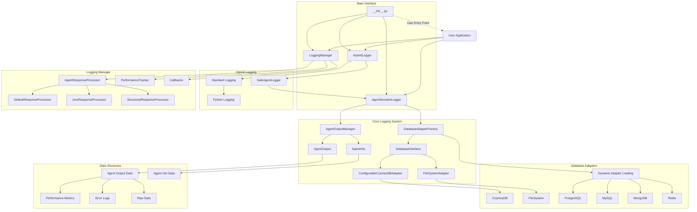
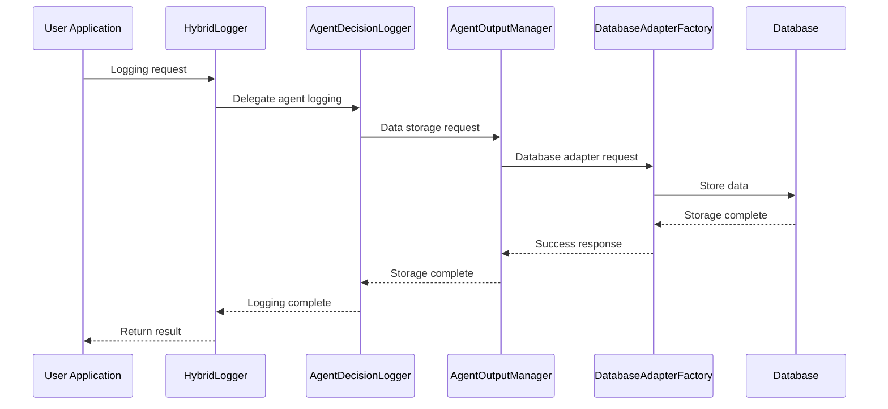

# Agent Logger - Universal AI Agent Logging System

[](https://www.python.org/downloads/)
[](LICENSE)
[]()

## 📋 Table of Contents

- [Overview](#-overview)
- [Key Features](#-key-features)
- [System Architecture](#-system-architecture)
- [Installation & Setup](#-installation--setup)
- [Usage](#-usage)
- [Advanced Features](#-advanced-features)
- [API Documentation](#-api-documentation)
- [Examples](#-examples)
- [System Operation](#-system-operation)
- [Contributing](#-contributing)
- [License](#-license)

## 🎯 Overview

Agent Logger is a universal logging system designed to systematically record and analyze all activities of AI agents. It provides enterprise-grade features including multi-database support, asynchronous processing, performance monitoring, and more.

### Core Features

- 🔄 **Hybrid Logging**: Integration of standard Python logging with custom agent logging
- 🗄️ **Multi-Database Support**: CosmosDB, PostgreSQL, MySQL, MongoDB, Redis, SQLite, FileSystem
- ⚡ **Asynchronous Processing**: High-performance async logging for system optimization
- 📊 **Performance Analytics**: Real-time performance metrics tracking and insights generation
- 🛡️ **Reliability**: Multi-fallback systems ensuring stable logging
- 🔧 **Configuration-Based**: Flexible configuration for different environments
- 🧠 **Learning Insights**: Agent pattern analysis and improvement recommendations

## 🚀 Key Features

### 1. Agent Activity Logging
- Record agent decision processes
- Store input/output data
- Track reasoning processes and execution steps
- Collect performance metrics

### 2. Multi-Database Support
```python
# Supported Databases
- Azure CosmosDB
- PostgreSQL
- MySQL
- MongoDB
- Redis
- SQLite
- FileSystem (default)
```

### 3. Learning Insights Generation
- Agent pattern analysis
- Performance trend analysis
- Improvement recommendations generation
- System health assessment

### 4. Asynchronous Processing
- Performance optimization through async logging
- Callback system support
- Real-time performance monitoring

### 5. Safe Logging
- Automatic encoding error handling
- File system error response
- Performance optimization through memory caching

## 🏗️ System Architecture



## 📦 Installation & Setup

### Basic Installation

```bash
# Clone repository
git clone https://github.com/your-repo/agent_logger.git
cd agent_logger

# Install dependencies
pip install -r requirements.txt
```

### requirements.txt

```txt
# Basic dependencies
dataclasses>=0.6; python_version < "3.7"
typing-extensions>=4.0.0

# Database adapters (optional)
azure-cosmos>=4.0.0  # CosmosDB
psycopg2-binary>=2.9.0  # PostgreSQL
pymongo>=4.0.0  # MongoDB
redis>=4.0.0  # Redis
# sqlite3 is built-in Python module

# Async processing
asyncio  # Built-in Python module

# Utilities
python-dateutil>=2.8.0
```

### Environment Configuration

```python
# config.py
LOGGING_CONFIG = {
    # Basic settings
    'database_type': 'filesystem',  # or 'cosmos', 'postgresql', etc.
    'filesystem_path': './agent_logs',
    
    # CosmosDB settings (optional)
    'cosmos_config': {
        'endpoint': 'your-cosmos-endpoint',
        'key': 'your-cosmos-key',
        'database_name': 'agent_logs',
        'container_name': 'agent_outputs'
    },
    
    # Performance settings
    'max_response_length': 10000,
    'error_threshold': 0.1,
    
    # Logging settings
    'disable_file_logging': False,
    'response_processor': 'default'  # 'json', 'structured'
}
```

## 💻 Usage

### 1. Basic Logging

```python
from agent_logger import AgentDecisionLogger

# Initialize logger
logger = AgentDecisionLogger()

# Log agent output
output_id = logger.log_agent_real_output(
    agent_name="AnalysisAgent",
    agent_role="Data Analyst",
    task_description="Customer data analysis",
    final_answer="Analysis complete: 85% satisfaction rate",
    reasoning_process="Customer satisfaction estimated through data pattern analysis",
    execution_steps=["Data load", "Preprocessing", "Analysis", "Result generation"],
    performance_metrics={"processing_time": 2.5, "accuracy": 0.85}
)

print(f"Log saved: {output_id}")
```

### 2. Hybrid Logging

```python
from agent_logger import HybridLogger

# Initialize hybrid logger
logger = HybridLogger("MySystem")

# Standard logging
logger.info("System started")
logger.warning("High memory usage")

# Agent decision logging
logger.log_agent_decision(
    agent_name="DecisionAgent",
    agent_role="Decision Making Agent",
    input_data={"user_input": "Stock investment advice"},
    decision_process={"analysis": "Market analysis", "risk_assessment": "Risk evaluation"},
    output_result={"recommendation": "Buy", "confidence": 0.8},
    reasoning="Based on market trends and technical analysis"
)
```

### 3. Asynchronous Logging

```python
import asyncio
from agent_logger import LoggingManager, HybridLogger

async def main():
    # Initialize logger and manager
    logger = HybridLogger()
    manager = LoggingManager(logger)
    
    # Async response logging
    response_id = await manager.log_agent_response(
        agent_name="AsyncAgent",
        agent_role="Async Processor",
        task_description="Large-scale data processing",
        response_data={"processed_items": 1000, "status": "success"},
        metadata={"batch_size": 100, "priority": "high"}
    )
    
    print(f"Async logging complete: {response_id}")

# Run
asyncio.run(main())
```

### 4. Database Configuration

```python
# CosmosDB configuration
cosmos_config = {
    'database_type': 'cosmos',
    'cosmos_config': {
        'endpoint': 'https://your-cosmos-account.documents.azure.com:443/',
        'key': 'your-primary-key',
        'database_name': 'agent_logs',
        'container_name': 'agent_outputs'
    }
}

logger = AgentDecisionLogger(cosmos_config)

# PostgreSQL configuration
postgres_config = {
    'database_type': 'postgresql',
    'postgres_config': {
        'host': 'localhost',
        'port': 5432,
        'database': 'agent_logs',
        'user': 'username',
        'password': 'password'
    }
}

logger = AgentDecisionLogger(postgres_config)
```

## 🔧 Advanced Features

### 1. Performance Monitoring

```python
from agent_logger import LoggingManager

manager = LoggingManager(logger)

# Get performance summary
performance = manager.get_performance_summary("AnalysisAgent")
print(f"Average response time: {performance['avg_response_time']:.2f}s")
print(f"Error rate: {performance['error_rate']:.2%}")

# System health check
health_report = manager.get_system_health_report()
print(f"System status: {health_report['overall_status']}")
```

### 2. Learning Insights

```python
# Get learning insights by agent
insights = logger.get_learning_insights("AnalysisAgent")

print("Pattern Analysis:")
for pattern in insights['patterns']:
    print(f"- {pattern['description']}")

print("Improvement Recommendations:")
for recommendation in insights['recommendations']:
    print(f"- {recommendation}")
```

### 3. Callback System

```python
def pre_log_callback(agent_name, response_data, metadata):
    print(f"Before logging: {agent_name} processing...")

def post_log_callback(agent_name, response_id, processed_response):
    print(f"Logging complete: {agent_name} -> {response_id}")

# Register callbacks
manager.register_pre_log_callback(pre_log_callback)
manager.register_post_log_callback(post_log_callback)
```

### 4. Custom Response Processor

```python
from agent_logger.logging_manager import AgentResponseProcessor

class CustomResponseProcessor(AgentResponseProcessor):
    def process_response(self, response_data: Any) -> str:
        if isinstance(response_data, dict) and 'custom_field' in response_data:
            return f"Custom processing: {response_data['custom_field']}"
        return str(response_data)

# Apply custom processor
config = {'response_processor': CustomResponseProcessor()}
manager = LoggingManager(logger, config)
```

## 📚 API Documentation

### AgentDecisionLogger

#### Main Methods

| Method | Description | Return Value |
|--------|-------------|--------------|
| `log_agent_real_output()` | Log agent actual output | `str` (output_id) |
| `log_agent_decision()` | Log agent decision | `str` (decision_id) |
| `log_agent_interaction()` | Log agent interactions | `str` (interaction_id) |
| `get_learning_insights()` | Get learning insights | `Dict` |
| `get_all_previous_results()` | Get previous results | `List[Dict]` |

### HybridLogger

#### Main Methods

| Method | Description | Return Value |
|--------|-------------|--------------|
| `log_agent_decision()` | Log agent decision | `str` |
| `log_agent_real_output()` | Log agent output | `str` |
| `log_processing_start()` | Log processing start | `str` |
| `log_quality_report()` | Log quality report | `str` |

### LoggingManager

#### Main Methods

| Method | Description | Return Value |
|--------|-------------|--------------|
| `log_agent_response()` | Async agent response logging | `str` |
| `get_performance_summary()` | Get performance summary | `Dict` |
| `get_system_health_report()` | Get system health report | `Dict` |

## 📖 Examples

### Example 1: Simple Agent Logging

```python
from agent_logger import AgentDecisionLogger

def simple_agent_example():
    logger = AgentDecisionLogger()
    
    # Agent task execution
    agent_name = "SimpleAgent"
    task = "Text analysis"
    result = "Positive sentiment analysis complete"
    
    # Logging
    output_id = logger.log_agent_real_output(
        agent_name=agent_name,
        agent_role="Text Analyst",
        task_description=task,
        final_answer=result,
        reasoning_process="Sentiment analysis algorithm applied",
        performance_metrics={"accuracy": 0.92, "processing_time": 1.2}
    )
    
    print(f"Task complete: {output_id}")

if __name__ == "__main__":
    simple_agent_example()
```

### Example 2: Multi-Agent Workflow

```python
import asyncio
from agent_logger import LoggingManager, HybridLogger

async def multi_agent_workflow():
    logger = HybridLogger("WorkflowSystem")
    manager = LoggingManager(logger)
    
    # Step 1: Data collection
    await manager.log_agent_response(
        agent_name="DataCollector",
        agent_role="Data Collector",
        task_description="Web data collection",
        response_data={"collected_items": 150, "sources": ["api1", "api2"]}
    )
    
    # Step 2: Data processing
    await manager.log_agent_response(
        agent_name="DataProcessor",
        agent_role="Data Processor",
        task_description="Data preprocessing and cleaning",
        response_data={"processed_items": 145, "cleaned_data": True}
    )
    
    # Step 3: Analysis
    await manager.log_agent_response(
        agent_name="DataAnalyzer",
        agent_role="Data Analyst",
        task_description="Statistical analysis",
        response_data={"analysis_result": "Significant correlation found", "confidence": 0.87}
    )
    
    # Workflow completion logging
    await manager.log_workflow_completion(
        workflow_name="Data Analysis Workflow",
        steps_completed=3,
        total_steps=3,
        workflow_result={"success": True, "total_processing_time": 15.3}
    )

# Run
asyncio.run(multi_agent_workflow())
```

### Example 3: Performance Monitoring Dashboard

```python
from agent_logger import LoggingManager, HybridLogger
import time

def performance_monitoring_dashboard():
    logger = HybridLogger("MonitoringSystem")
    manager = LoggingManager(logger)
    
    # Simulate multiple agent tasks
    agents = ["AgentA", "AgentB", "AgentC"]
    
    for agent in agents:
        # Simulate task execution
        start_time = time.time()
        time.sleep(0.1)  # Task simulation
        processing_time = time.time() - start_time
        
        # Logging
        manager.log_agent_response(
            agent_name=agent,
            agent_role="Test Agent",
            task_description="Performance test",
            response_data={"test_result": "success"},
            metadata={"processing_time": processing_time}
        )
    
    # Performance summary output
    print("=== Performance Monitoring Dashboard ===")
    for agent in agents:
        performance = manager.get_performance_summary(agent)
        print(f"{agent}:")
        print(f"  - Average response time: {performance['avg_response_time']:.3f}s")
        print(f"  - Total requests: {performance['total_requests']}")
        print(f"  - Error rate: {performance['error_rate']:.2%}")
        print()

if __name__ == "__main__":
    performance_monitoring_dashboard()
```

## 🔍 System Operation

### 1. Data Flow



### 2. Component Interactions

#### AgentDecisionLogger
- **Role**: Main logger for agent activities
- **Features**: 
  - Session-based logging management
  - Data structuring and validation
  - Learning insights generation
- **Operation**:
  1. Generate session ID
  2. Validate input data
  3. Delegate storage to AgentOutputManager
  4. Collect performance metrics

#### HybridLogger
- **Role**: Integration of standard and agent logging
- **Features**:
  - Dual logging (standard + agent)
  - Safe logging (error recovery)
  - Configuration-based initialization
- **Operation**:
  1. Basic logging with standard Python logger
  2. Detailed logging with AgentDecisionLogger
  3. Fallback to console output on errors

#### LoggingManager
- **Role**: Async logging and performance management
- **Features**:
  - Async logging processing
  - Response data preprocessing
  - Performance tracking and monitoring
- **Operation**:
  1. Process logging with async executor
  2. Preprocess data with response processor
  3. Collect and analyze performance metrics

### 3. Database Adapter System

#### DatabaseAdapterFactory
- **Role**: Factory for multi-database support
- **Supported Databases**:
  - Azure CosmosDB
  - PostgreSQL/MySQL
  - MongoDB/Redis
  - SQLite/FileSystem
- **Operation**:
  1. Select adapter based on configuration
  2. Dynamic adapter loading
  3. Fallback to FileSystem on connection failure

#### ConfigurableCosmosDBAdapter
- **Role**: Support various CosmosDB connection methods
- **Connection Methods**:
  - Direct connection information
  - Module path-based
  - Factory function
  - Existing instance

### 4. Performance Optimization

#### Memory Caching
- Cache recent log data in memory
- Automatic cache size management
- Memory usage monitoring

#### Async Processing
- Async execution of logging tasks
- Minimize performance bottlenecks
- Improve system responsiveness

#### Safe Logging
- Automatic encoding error handling
- File system error response
- Multi-fallback systems

### 5. Learning Insights System

#### Pattern Analysis
- Identify agent activity patterns
- Performance trend analysis
- Anomaly pattern detection

#### Improvement Recommendations
- Generate performance-based recommendations
- System optimization suggestions
- Agent tuning guides

## 🤝 Contributing

To contribute to this project, please follow these steps:

1. Fork this repository
2. Create a new feature branch (`git checkout -b feature/amazing-feature`)
3. Commit your changes (`git commit -m 'Add amazing feature'`)
4. Push to the branch (`git push origin feature/amazing-feature`)
5. Create a Pull Request

### Development Environment Setup

```bash
# Install development dependencies
pip install -r requirements-dev.txt

# Run tests
python -m pytest tests/

# Code style check
flake8 agent_logger/
black agent_logger/
```

### requirements-dev.txt

```txt
# Development dependencies
pytest>=7.0.0
pytest-asyncio>=0.21.0
flake8>=5.0.0
black>=22.0.0
mypy>=1.0.0
```

## 📄 License

This project is licensed under the MIT License. See the [LICENSE](LICENSE) file for details.

## 📞 Support

- **Issue Reports**: [GitHub Issues](https://github.com/your-repo/agent_logger/issues)
- **Documentation**: [Wiki](https://github.com/your-repo/agent_logger/wiki)
- **Email**: support@agent-logger.com

## 🙏 Acknowledgments

This project has been helped by the following open source projects:

- [Python Logging](https://docs.python.org/3/library/logging.html)
- [Azure Cosmos DB](https://azure.microsoft.com/services/cosmos-db/)
- [PostgreSQL](https://www.postgresql.org/)
- [MongoDB](https://www.mongodb.com/)

---

**Agent Logger** - Systematically record and analyze all activities of AI agents! 🚀 